

# Dev_Setup
Setup Development Environment

#Assignment: Setting Up Your Developer Environment

#Objective:
This assignment aims to familiarize you with the tools and configurations necessary to set up an efficient developer environment for software engineering projects. Completing this assignment will give you the skills required to set up a robust and productive workspace conducive to coding, debugging, version control, and collaboration.

#Tasks:

1. Select Your Operating System (OS):
   Choose an operating system that best suits your preferences and project requirements. Download and Install Windows 11. https://www.microsoft.com/software-download/windows11

1.visit the Windows 11 Download Page ,an official Microsoft download page with options to download the installation media.
2.there will be Step-by-step prompts in the Media Creation Tool, including language, edition, and architecture selection.
3.insert the  USB flash drive and Restart your PC and boot from the flash. Initial Windows Setup screen prompting you to choose your language, time, and keyboard preferences.
4. The Windows Setup screen with "Install now" button appears
5.Check the box to accept the license terms and click "Next.
6.Select "Custom: Install Windows only (advanced)" for a clean installation.
7.Select the partition where you want to install Windows 11 and click "Next." The setup will copy files, install features, and update.
8.Setup screens asking for my region, keyboard layout, account setup, and privacy settings.

2. Install a Text Editor or Integrated Development Environment (IDE):
   Select and install a text editor or IDE suitable for your programming languages and workflow. Download and Install Visual Studio Code. https://code.visualstudio.com/Download

1.Visit the Download Page and Click on the download button for the Windows version. This will download the installer file .

2.Follow the steps in the setup wizard and accept the Agreement. 
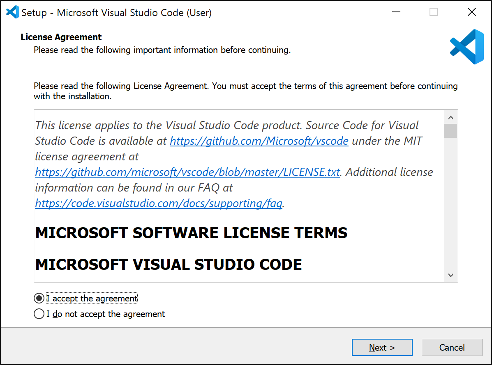

3.Click the "Install" button to begin the installation process.
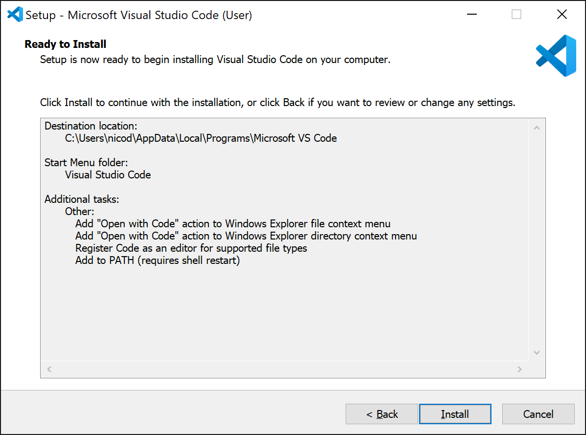
4.Once the installation is complete, click the "Finish" button. 
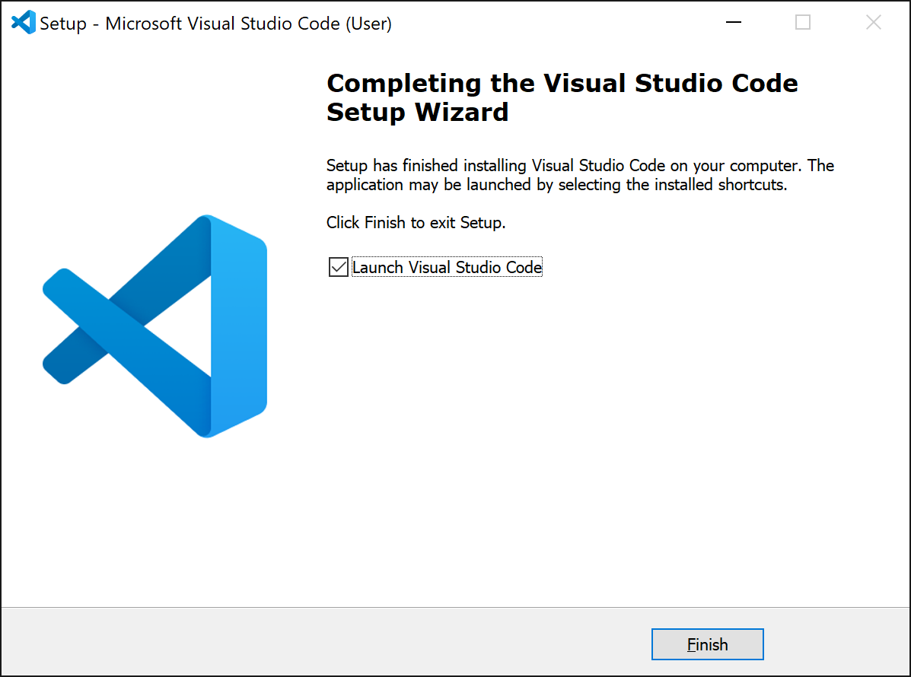

3. Set Up Version Control System:
   Install Git and configure it on your local machine. Create a GitHub account for hosting your repositories. Initialize a Git repository for your project and make your first commit. https://github.com

4. Install Necessary Programming Languages and Runtimes:
  Instal Python from http://wwww.python.org programming language required for your project and install their respective compilers, interpreters, or runtimes. Ensure you have the necessary tools to build and execute your code.

5. Install Package Managers:
   If applicable, install package managers like pip (Python).

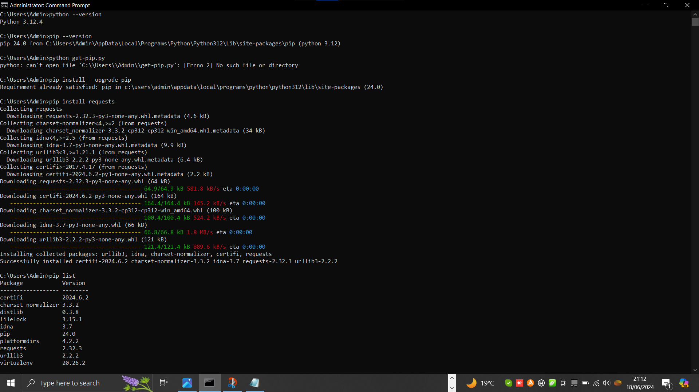

6. Configure a Database (MySQL):
   Download and install MySQL database. https://dev.mysql.com/downloads/windows/installer/5.7.html

1. Go on to mySQL website to download.

2. Click the Download button under MySQL Installer 5.7 for Windows.
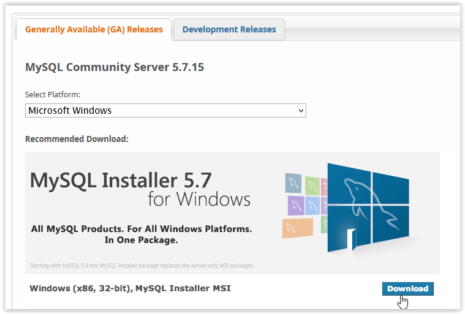
3. After clicking Download, choose which Installer to use by clicking Download.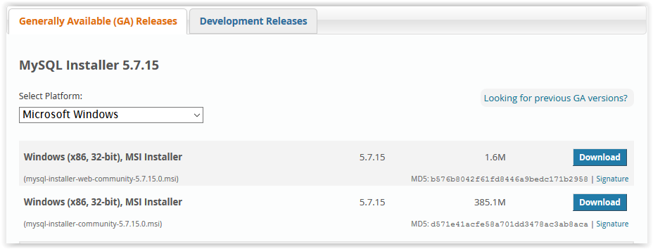
4. In order to download, you must click Login, Sign Up, or click No thanks, just start my download.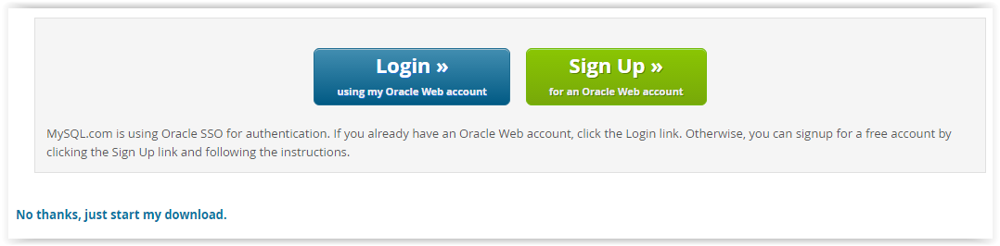
5. If prompted, select Yes to allow changes to the computer.

6. After downloading, check the I accept box under the License Agreement and click Next.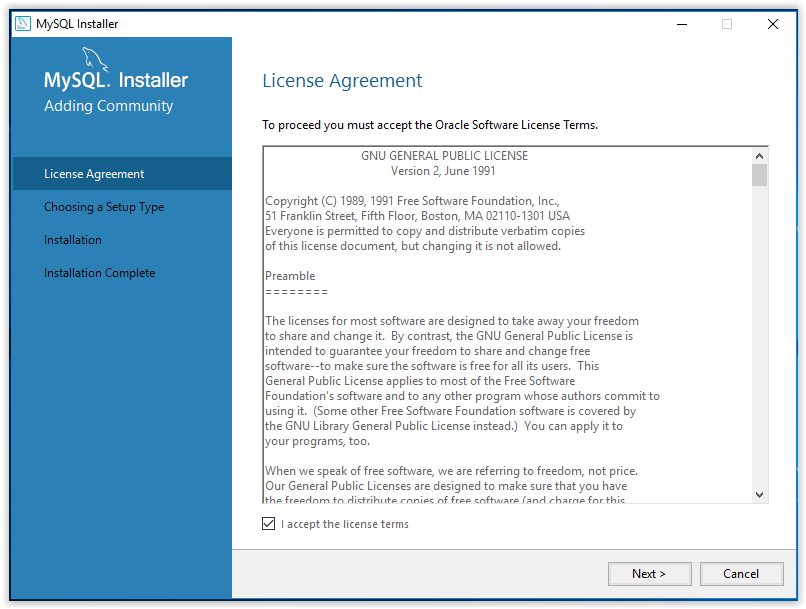
7. Select the Setup Type then click Next.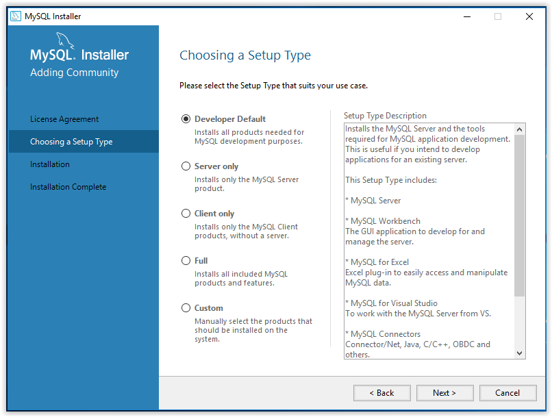
8.When the installation is complete, click Next.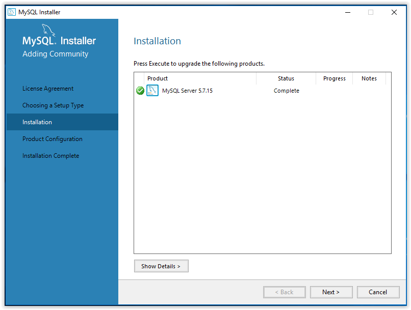
9.Set an account password, then click Next.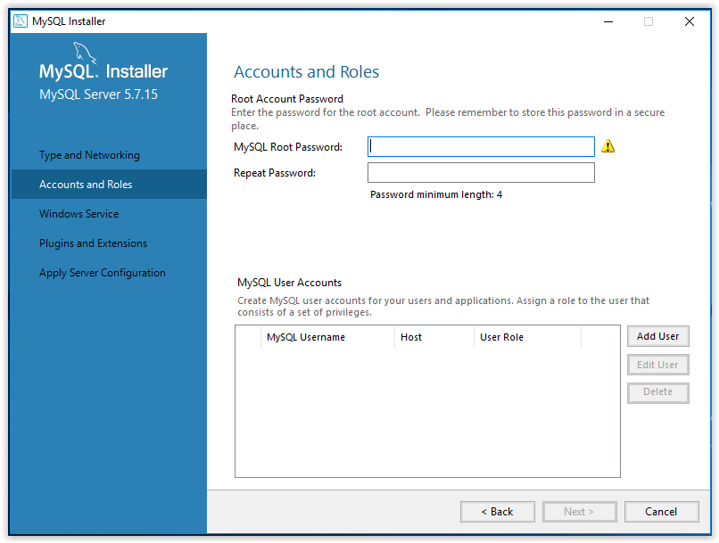
10.To apply the chosen settings, click Execute in the Apply Server Configuration window.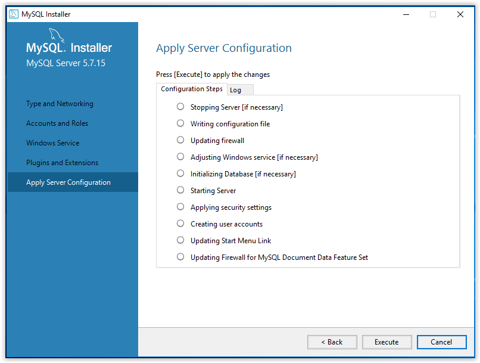
11.When the configuration is complete, click Finish.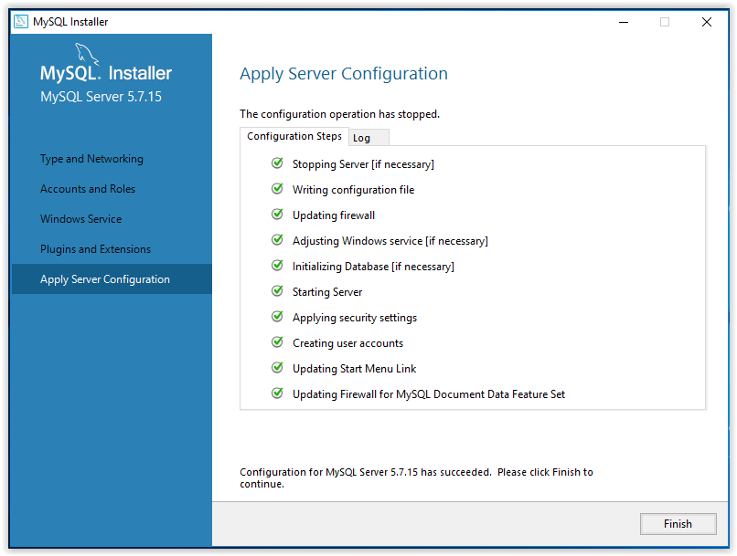

7. Set Up Development Environments and Virtualization (Optional):
   Consider using virtualization tools like Docker or virtual machines to isolate project dependencies and ensure consistent environments across different machines.
   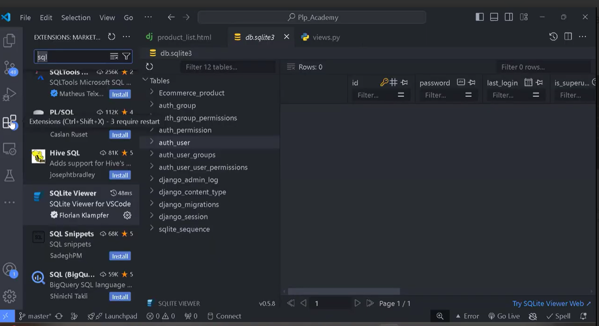

8. Explore Extensions and Plugins:
   Explore available extensions, plugins, and add-ons for your chosen text editor or IDE to enhance functionality, such as syntax highlighting, linting, code formatting, and version control integration.

9. Document Your Setup:
    Create a comprehensive document outlining the steps you've taken to set up your developer environment. Include any configurations, customizations, or troubleshooting steps encountered during the process. 

    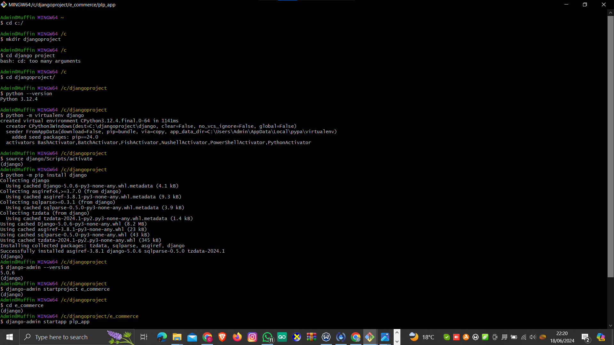
    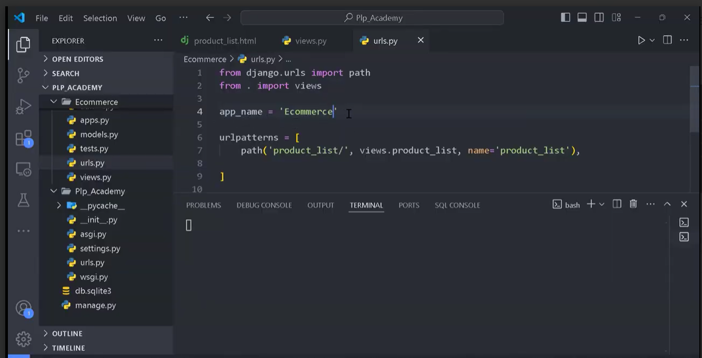

#Deliverables:
- Document detailing the setup process with step-by-step instructions and screenshots where necessary.
- A GitHub repository containing a sample project initialized with Git and any necessary configuration files (e.g., .gitignore).
- A reflection on the challenges faced during setup and strategies employed to overcome them.

#Submission:
Submit your document and GitHub repository link through the designated platform or email to the instructor by the specified deadline.

#Evaluation Criteria:**
- Completeness and accuracy of setup documentation.
- Effectiveness of version control implementation.
- Appropriateness of tools selected for the project requirements.
- Clarity of reflection on challenges and solutions encountered.
- Adherence to submission guidelines and deadlines.

Note: Feel free to reach out for clarification or assistance with any aspect of the assignment.
